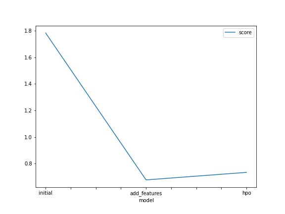
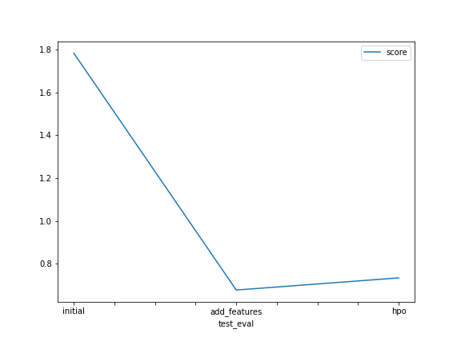

# Report: Predict Bike Sharing Demand with AutoGluon Solution
#### NAME HERE

## Initial Training
### What did you realize when you tried to submit your predictions? What changes were needed to the output of the predictor to submit your results?
After making the first set of predictions, the mean of the whole data was 101.245926 and there were no negative values in the predictions. 
To be able to submit the predictions, all negative values needed to be approximated to zero. 

### What was the top ranked model that performed?
The top ranked model was the WeightedEnsemble_L3 model with a score val of -53.122898.

## Exploratory data analysis and feature creation
### What did the exploratory analysis find and how did you add additional features?
Converting the datetime field in the dataset into a datetime object made it easy to create new features from the datetime object. 
The new features created are the month, day, and hour features. 

### How much better did your model preform after adding additional features and why do you think that is?
After adding additional features, the score dropped from 1.78403 to 0.67665.
The score dropped because I added additional features whicn in turn means that the model has more features to predict and more work to do. 

## Hyper parameter tuning
### How much better did your model preform after trying different hyper parameters?
When the num_bag_folds, num_bag_sets, and refit_full parameters were added, the model performed better with an increased score of 0.73341, from the previous score of  0.67665.

### If you were given more time with this dataset, where do you think you would spend more time?
I'd spend more time on hyperparameter optimization by increasing the training time,and the num_stack_levels parameter to maximize predictive performance. 

### Create a table with the models you ran, the hyperparameters modified, and the kaggle score.
|model|num_bag_folds|num_bag_sets|refit_full|score|
|--|--|--|--|--|
|initial|0|1|False|1.78403|
|add_features|0|1|False|0.67665|
|hpo|0|1|True|0.73341|

### Create a line plot showing the top model score for the three (or more) training runs during the project.

TODO: Replace the image below with your own.

### Create a line plot showing the top kaggle score for the three (or more) prediction submissions during the project.

TODO: Replace the image below with your own.

## Summary
Adding more features to a dataset increases the workload on a model thereby reducing the accuracy or predictions.
However, hyperparameter optimizations, giving more training time to a model helps the model perform better and give better predictive values. 
